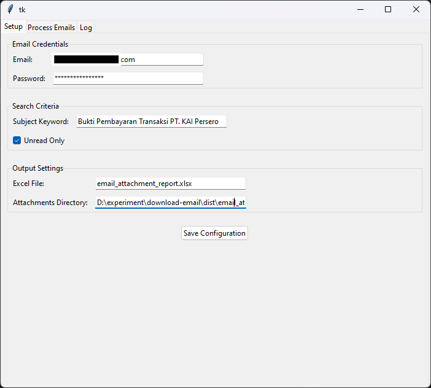
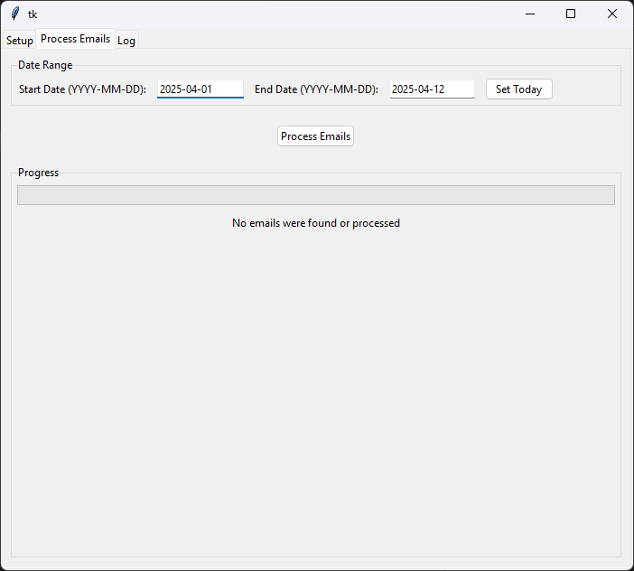

## Project: Download Email

This repository contains tools and scripts for downloading and managing emails efficiently. It is designed to simplify email retrieval and processing for various use cases.

---

## Features

- Download emails from supported email providers.
- Parse and organize email content.
- Save emails in structured formats (e.g., JSON, plain text).
- Easy-to-use and customizable.

---

## Installation

1. Clone the repository:
    ```bash
    git clone https://github.com/your-username/downloadEmail.git
    cd downloadEmail
    ```

2. Install dependencies:
    ```bash
    # Example for Python
    pip install -r requirements.txt
    ```

---

## Usage

1. Configure your email settings in the `.env` file.
2. Run the script:
    ```bash
    ```markdown
    # For reading emails and extracting to Excel:
    python main.py

    # For reading emails, extracting to Excel, and downloading attachments:
    python download_attachment.py

    # For a GUI desktop app with similar functionality:
    python email_processor.py
    ```
    ```

---

## GUI App Screenshot




## Contact

For questions or support, please open an issue or contact the repository owner.
